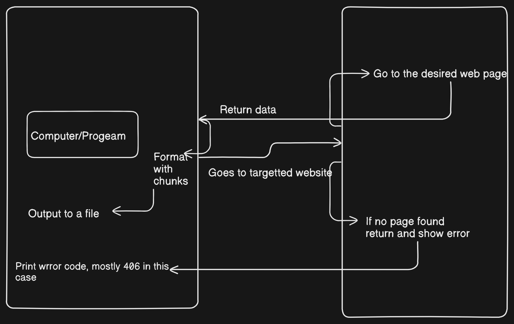

# School Website Scraper

A Python-based project to scrape and process text content from a school’s website, excluding unnecessary elements like images, styles, and scripts. The project is designed to extract relevant information such as paragraphs and headings, clean and prepare it in chunks for embedding generation or further processing.

---

## Table of Contents

- [Features](#features)
- [Usage](#usage)
---

## Features

- **Efficient Web Scraping**: Fetches the raw HTML from the website and removes unnecessary tags like `script`, `style`, `footer`, `header`, and `nav`.
- **Text Cleaning**: Processes and cleans the text to remove extra whitespace, special characters, and organize it into structured sections.
- **Chunking for Embeddings**: Splits cleaned text into manageable chunks to facilitate embedding generation or other processing.

## Usage
To scrape and process text from your school's website:
1. Make sure the URL and headers are configured in the `config.py` file.
2. Run the script:
   ```bash
   python scraper.py
3. The output will display a preview of the processed chunks.

## Highly specific diagram of how it will fundamentally work
